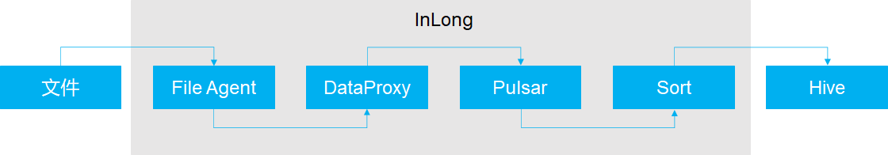
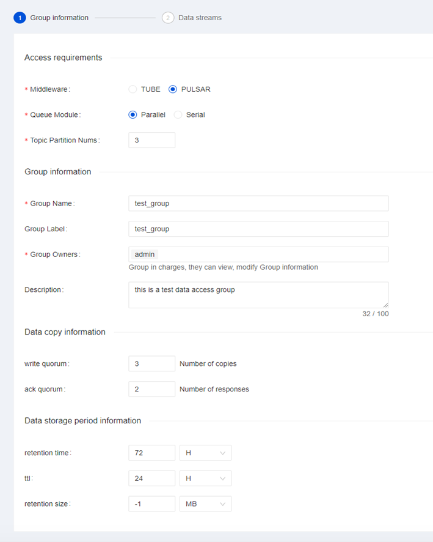
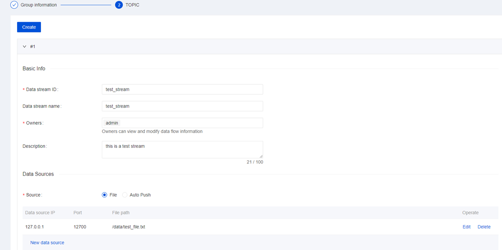
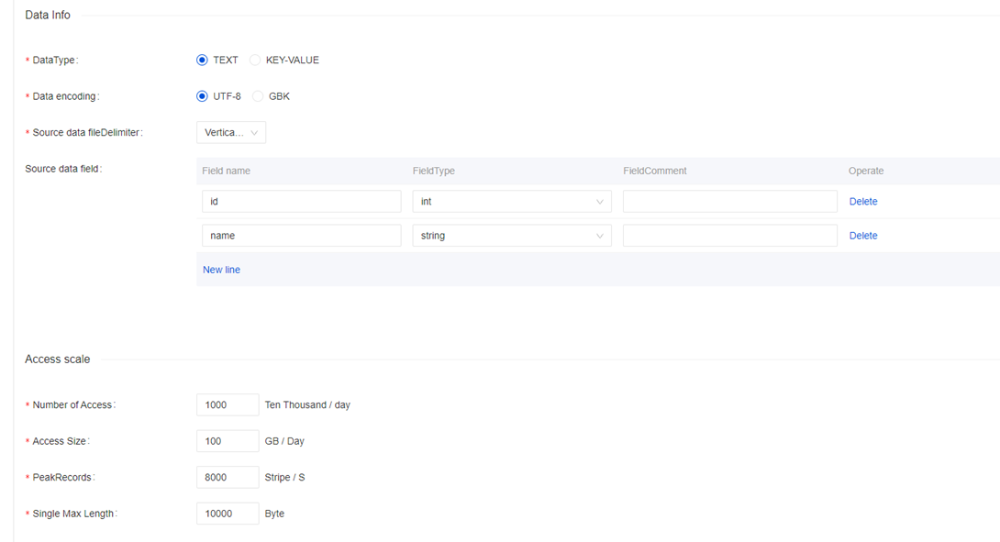
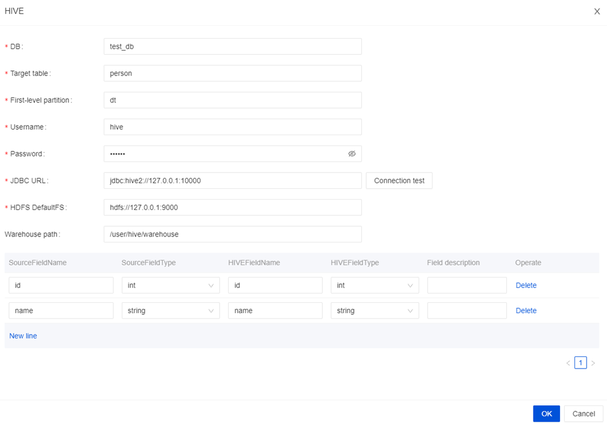

Apache InLong has increased the ability to access data through Apache Pulsar, taking full advantage of Pulsar's technical advantages that are different from other MQ, and providing complete solutions for data access scenarios with higher data quality requirements such as finance and billing.
In the following content, we will use a complete example to introduce Apache Pulsar to access data through Apache InLong.



## Install Pulsar
Please refer to [Official Installation Guidelines](https://pulsar.apache.org/docs/en/standalone/).

## Install Hive
Hive is the necessary component. If you don't have Hive in your machine, we recommand using Docker to install it. Details can be found [here](https://github.com/big-data-europe/docker-hive).

> Note that if you use Docker, you need to add a port mapping `8020:8020`, because it's the port of HDFS DefaultFS, and we need to use it later.

## Install InLong
Before we begin, we need to install InLong. Here we provide two ways:
1. Install InLong with Docker by according to the [instructions here](deployment/docker.md).(Recommanded)
2. Install InLong binary according to the [instructions here](deployment/bare_metal.md).

区别于 InLong TubeMQ，如果使用 Apache Pulsar，需要在 Manager 组件安装中配置 Pulsar 集群信息，格式如下：
```
# Pulsar admin URL
pulsar.adminUrl=http://127.0.0.1:8080,127.0.0.2:8080,127.0.0.3:8080
# Pulsar broker address
pulsar.serviceUrl=pulsar://127.0.0.1:6650,127.0.0.1:6650,127.0.0.1:6650
# Default tenant of Pulsar
pulsar.defaultTenant=public
```

## 创建数据接入
### 配置数据流 Group 信息

在创建数据接入时，数据流 Group 可选用的消息中间件选择 Pulsar，其它跟 Pulsar 相关的配置项还包括：
- Queue module：队列模型，并行或者顺序，选择并行时可设置 Topic 的分区数，顺序则为一个分区；
- Write quorum：消息写入的副本数
- Ack quorum：确认写入 Bookies 的数量
- retention time：已被 consumer 确认的消息被保存的时间
- ttl：未被确认的消息的过期时间
- retention size：已被 consumer 确认的消息被保存的大小

### 配置数据流

配置消息来源时，文件数据源中的文件路径，可参照 inlong-agent 中[File Agent的详细指引](https://inlong.apache.org/docs/next/modules/agent/file#file-agent-configuration)。

### 配置数据格式


### 配置 Hive 集群
保存 Hive 流向，点击“提交审批”。


## 数据接入审批
进入**审批管理**页面，点击**我的审批**，审批上面提交的接入申请，审批结束后会在 Pulsar 集群同步创建数据流需要的 Topic 和订阅。
我们可以在 Pulsar 集群使用命令行工具检查 Topic 是否创建成功：


## 配置文件 Agent
在配置文件 Agent 时，需要根据数据接入创建时指定的目录下创建文件：
```
touch /data/test_file.txt;
```

按照创建数据流时的数据源格式，向文件中写入数据（可以按格式写入更多数据）：
```
echo -e "1|test\n2|test\n" >> /data/test_file.txt
```

## 数据落地检查

最后，我们登入 Hive 集群，通过 Hive 的 SQL 命令查看 `test_stream` 表中是否成功插入了数据。

## 问题排查
如果出现数据未正确写入 Hive 集群，可以检查 Dataproxy 和 Sort 相关信息是否同步：
- 检查 Inlong-Dataproxy 的 conf/topics.properties 文件夹中是否正确写入该数据流对应的Topic 信息：
```
b_test_group/test_stream=persistent://public/b_test_group/test_stream
```

- 检查 InLong  Sort 监听的 ZooKeeper 中是否成功推送了数据流的配置信息：
```
get /inlong_hive/dataflows/{{sink_id}}
```
